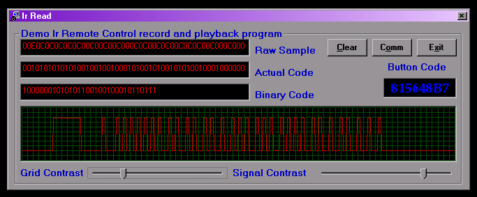



## Ir Remote Control

### Description

This version only works reliably with olderstyle Panosonic or REC-80 remotes, and a PC with pentium 200 Mhz or better. VB does not interface well with the hardware directly. I will admit that VC will do a better job at what I am doing with VB. I have used the Receive line as it is more stable and I have figured out how to read the signals. I began with using a 850 MHz Celeron machine, it captured the IR signal well on the DCD line, however slower machines did not fair so well.

I first used Winlirc to decode the buttons of the remotes I am using, and compared them with a digital scope reading, and figured that the raw signal looked a lot similar to a signal being transmitted beteen 9600 and 14400 baud.
 
### More Info
 
For REC-80 Remotes it will return a button code, somewhat close to the way Winlirc does, however not in as much broken down detail.

             |
---                |---
**Submitted On**   |2005-04-24 15:11:10
**By**             |[CrackerBox](https://github.com/Planet-Source-Code/PSCIndex/blob/master/ByAuthor/crackerbox.md)
**Level**          |Intermediate
**User Rating**    |5.0 (10 globes from 2 users)
**Compatibility**  |VB 6\.0
**Category**       |[Miscellaneous](https://github.com/Planet-Source-Code/PSCIndex/blob/master/ByCategory/miscellaneous__1-1.md)
**World**          |[Visual Basic](https://github.com/Planet-Source-Code/PSCIndex/blob/master/ByWorld/visual-basic.md)
**Archive File**   |[Ir\_Remote\_1880754242005\.zip](https://github.com/Planet-Source-Code/crackerbox-ir-remote-control__1-48563/archive/master.zip)

